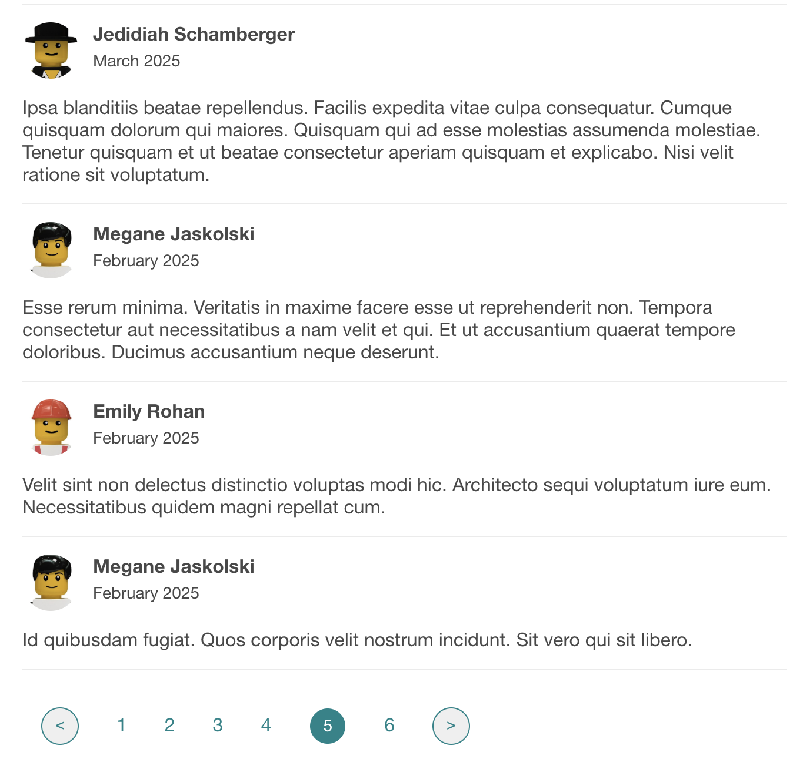

# clonebnb



### Description

The reviews component for a travel accommodations service. 

### Requirements

- npm v8.12.x
- MySQL v5.7.x

Warning: MySQL v8 introduces a new authentication plugin utilizing `caching_sha256_password`. Since the MySQL JavaScript driver does not support this feature yet, so make sure to use MySQL v5.7.x, OR make sure to use the `mysql_native_password` authentication plugin.

### App Configuration

- Make sure to write a `<rootDir>/db/config.js` based off `<rootDir>/db/config.example.js`.

### Installation

1. Install project dependencies
```sh
npm install
```

2. Start up your MySQL server, then seed the database:
```sh
npm run db:genseed
```

3. Create a client bundle
```sh
npm run build
```

4. To start the server, run 
```sh
npm start
```

5. To see the fruit of your labors, go to `localhost:3000/listings/:id`

### Testing

```sh
npm test
```

### Mock Data

In order to seed the database with mock data, run `npm run db:genseed` to run a script that generates .csv files that will be loaded onto your MySQL database. You may edit the number of records for each table in `./db/generateCsv.js`.
